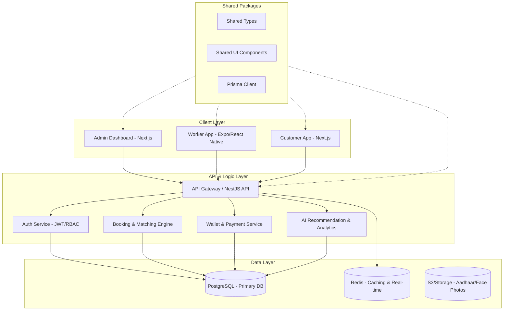

# Enterprise System Architecture - Unorganized Employee Management System

## 1. Overview
The platform is built as a multi-tenant SaaS application to manage unorganized workers. It follows a clean architecture pattern with a monorepo approach for shared logic, types, and UI components.

## 2. High-Level Architecture

## 3. Technology Stack
- **Monorepo**: Turborepo
- **Backend**: NestJS, Prisma, PostgreSQL, Redis, Socket.io
- **Frontend**: Next.js, ShadCN UI, Tailwind CSS
- **Mobile**: Expo (React Native)
- **AI**: Gemini API / OpenAI API / LangChain
- **DevOps**: Docker, Dokploy, NGINX

## 4. Multi-tenancy Strategy
- **Isolation**: Tenant ID column in shared tables (Row-Level Security / Application Level filtering).
- **Configuration**: Tenant-specific branding and settings stored in `TenantSettings` table.

## 5. Security
- **Authentication**: JWT with Refresh Token Rotation.
- **Authorization**: RBAC (Role-Based Access Control).
- **Compliance**: Input sanitization, rate limiting, and encrypted storage for sensitive data.
